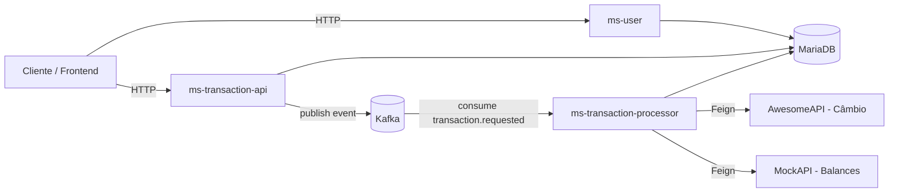
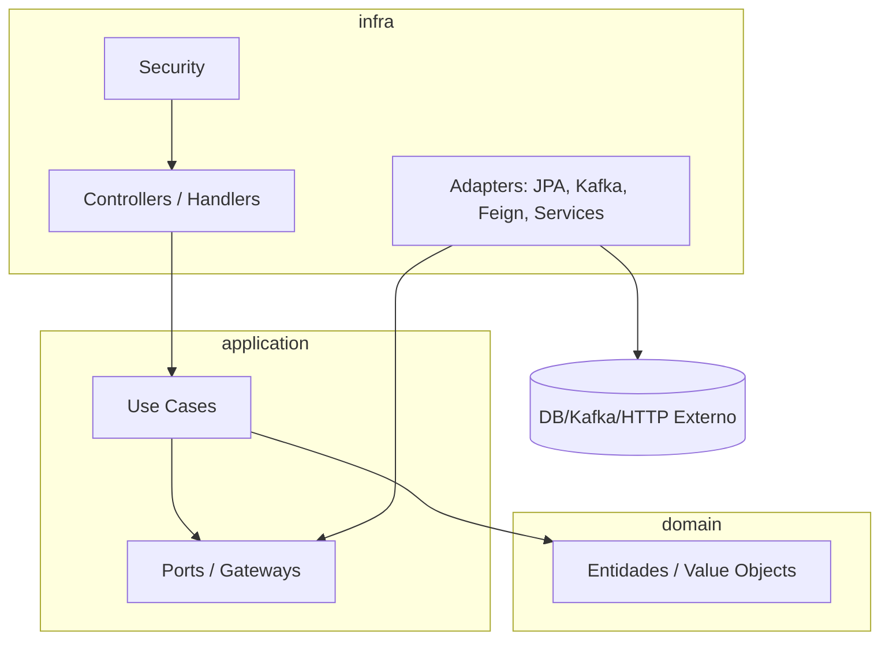
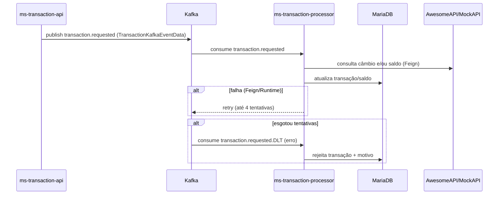

# Gestão Financeira (Microservices)

Plataforma de **gestão financeira** construída em **Java 21 + Spring Boot 3**, organizada em **múltiplos microserviços** com mensageria via **Kafka** e persistência em **MariaDB**.

**Módulos (Maven multi-module):**
- `ms-user` — autenticação (JWT) e gestão de clientes/usuários.
- `ms-transaction-api` — API REST de transações e relatórios (inclui geração de PDF).
- `ms-transaction-processor` — consumidor Kafka responsável por processar transações e aplicar regras (saldo/câmbio).
- `common-lib` — tipos/contratos compartilhados entre serviços.

---

## Stack

- **Java 21**
- **Spring Boot 3.5.x** + **Spring Cloud 2025.x**
- **Spring Security + JWT**
- **Kafka**
- **MariaDB**
- **Flyway** (migrações em `prod`)
- **OpenAPI/Swagger UI** via `springdoc`

---

## Pré-requisitos

### Para rodar local (sem Docker)
- Java **21+**
- Maven **3.9+**
- MariaDB **11** (ou compatível)
- Kafka (broker exposto em `localhost:9092`)
  - A versão do Kafka usada no momento foi a 4.1.1

### Para rodar com Docker
- Docker
- Docker Compose

---

## Como rodar (modo Docker) ✅ (recomendado)

Na raiz do repositório:

```bash
docker docker-compose up -d
```
Para rebuildar
```bash
docker docker-compose up -d --build
```

Serviços expostos (host → container):
- `ms-user`: `http://localhost:8081`
- `ms-transaction-api`: `http://localhost:8082`
- `ms-transaction-processor`: `http://localhost:8083` (sem endpoints REST; é consumidor Kafka)
- MariaDB: `localhost:3306`
- Kafka: `localhost:9092`

> Em `prod`, os serviços usam `SPRING_PROFILES_ACTIVE=prod` e variáveis de ambiente (JWT/DB) definidas no `docker-compose.yml`.

---

## Como rodar (modo DEV local) 🛠️

1) Suba infra (MariaDB + Kafka) via Docker:

```bash
docker compose -f docker-compose-dev.yml up -d
```

2) Execute cada serviço com o profile `dev`:

```bash
# ms-user (porta 8081)
mvn -pl ms-user spring-boot:run -Dspring-boot.run.profiles=dev

# ms-transaction-api (porta 8082)
mvn -pl ms-transaction-api spring-boot:run -Dspring-boot.run.profiles=dev

# ms-transaction-processor (porta 8083)
mvn -pl ms-transaction-processor spring-boot:run -Dspring-boot.run.profiles=dev
```

Configurações DEV (por padrão):
- DB em `jdbc:mariadb://localhost:3306/becajava`
- Kafka em `localhost:9092`
- Swagger habilitado em `ms-user` e `ms-transaction-api`

---

## Documentação OpenAPI (Swagger)

Em DEV:
- `ms-user`: `http://localhost:8081/swagger-ui.html`
- `ms-transaction-api`: `http://localhost:8082/swagger-ui.html`

Essas UIs carregam os contratos em:
- `/openapi/openapi.yaml` (arquivo estático em `src/main/resources/static/openapi/`)

---

## Arquitetura

Este projeto adota **Clean Architecture** (Ports & Adapters) em cada microserviço.

### Camadas (por serviço)

- **domain**  
  Entidades e regras de negócio puras (sem dependências de framework).

- **application**  
  Casos de uso (use cases) e **ports/gateways** (interfaces) que descrevem o que o domínio precisa.

- **infra**  
  Implementações dos ports (adapters), integrações (JPA, Kafka, Feign, Security), controllers, DTOs e mappers.

### Diagrama de módulos (visão macro)



### Diagrama Clean Architecture (por microserviço)



---

## Mensageria (Kafka)

O processamento assíncrono roda no `ms-transaction-processor`:

- **Tópico principal:** `transaction.requested`  
  Consumidor com retry automático (`@RetryableTopic`, *attempts=4*, *backoff=5s*).

- **DLT (Dead Letter Topic):** `transaction.requested.DLT`  
  Quando esgota as tentativas, a mensagem cai na DLT e o processor chama o caso de uso de rejeição (registrando o motivo).



---

## Endpoints (REST)

### `ms-user` — Base URL: `http://localhost:8081`

| Método | Rota | Responsável | Descrição                                                       |
|---|---|---|-----------------------------------------------------------------|
| POST | `/api/v1/auth/login` | `LoginController#login` | Autentica e retorna tokens JWT.                                 |
| POST | `/api/v1/auth/refresh` | `LoginController#refreshToken` | Gera novo access token via refresh token.                       |
| POST | `/api/v1/customers` | `CustomerController#create` | Cadastra um novo cliente. |                                      |
| GET | `/api/v1/customers` | `CustomerController#getAllUsers` | Lista os cliente paginado.                                       |
| GET | `/api/v1/customers/{id}` | `CustomerController#read` | Busca o cliente por id (**requer autenticação e ser dono**).    |
| PUT | `/api/v1/customers/{id}` | `CustomerController#update` | Atualiza cliente por id (**requer autenticação e ser dono.**). |
| DELETE | `/api/v1/customers/{id}` | `CustomerController#delete` | Remove cliente por id (**requer autenticação e ser dono.**).   |
| POST | `/api/v1/customers/batch-register` | `CustomerController#upload` | Upload (multipart) para cadastro em lote.                       |
| GET | `/api/v1/customers/batch-register/{id}` | `CustomerController#checkUploadStatus` | Consulta status do processamento do batch.                      |

**Principais DTOs (web):**
- `CustomerCreateRequest`, `CustomerUpdateRequest` (`infra/web/dto`)
- `LoginRequest`, `RefreshTokenRequest` (`infra/web/dto`)
- Respostas: `CustomerInfoResponse`, `FileUploadResponse`, `TokenResponse` (`dto`)

---

### `ms-transaction-api` — Base URL: `http://localhost:8082`

| Método | Rota | Responsável | Descrição |
|---|---|---|---|
| GET | `/api/v1/transactions` | `TransactionController#getAll` | Lista transações do usuário autenticado (paginado). |
| GET | `/api/v1/transactions/{id}` | `TransactionController#show` | Detalhe de transação por id. |
| DELETE | `/api/v1/transactions/{id}` | `TransactionController#delete` | Remove uma transação por id. |
| POST | `/api/v1/transactions/deposit` | `TransactionController#deposit` | Solicita depósito (gera evento Kafka). |
| POST | `/api/v1/transactions/withdraw` | `TransactionController#withdraw` | Solicita saque (gera evento Kafka). |
| POST | `/api/v1/transactions/transfer` | `TransactionController#transfer` | Solicita transferência (gera evento Kafka). |
| POST | `/api/v1/transactions/custom` | `TransactionController#customTransaction` | Solicita transação customizada (gera evento Kafka). |
| GET | `/api/v1/expenses/{userId}/summary/category` | `ExpenseAnalysisController#totalByCategory` | Total por categoria (por período). |
| GET | `/api/v1/expenses/{userId}/summary/day` | `ExpenseAnalysisController#totalByDay` | Total por dia (por período). |
| GET | `/api/v1/expenses/{userId}/summary/month` | `ExpenseAnalysisController#totalByMonth` | Total por mês (por período). |
| GET | `/api/v1/expenses/{userId}/summary/download` | `ExpenseAnalysisController#downloadPdf` | Gera e baixa PDF do relatório (por período). |

**Principais DTOs (web):**
- Requests: `TransactionCreateRequest`, `TransactionWithdrawCreateRequest`, `TransactionTransferCreateRequest` (`infra/web/dto`)
- Responses: `TransactionCreatedResponseDto`, `TransactionDetailResponse`, `PaginatedResponse` (`dto/domain`)
- Relatórios: `ExpenseByCategory`, `ExpenseByDay`, `ExpenseByMonth` (`dto`)

---

### `ms-transaction-processor` — (sem REST)

Consome mensagens Kafka e executa o processamento/rejeição:

- `TransactionRequestedConsumer#consume` → tópico `transaction.requested`
- `TransactionRequestedConsumer#consumeDlq` → tópico `transaction.requested.DLT`

Integrações externas (Feign):
- `ICambioApiClient` → `services.external.cambio-api` (AwesomeAPI)
- `IMockApiClient` → `services.external.mock-api` (MockAPI)

---

## Principais classes (por módulo)

### `ms-user`

**Controllers**
- `infra/web/controller/LoginController`
- `infra/web/controller/CustomerController`
- `infra/web/handler/GlobalExceptionHandler`

**Use cases (`application/usecase`)**
- `login`: `LoginUserCase`, `RefreshTokenUserCase`
- `customer`: `RegisterNewCustomerUseCase`, `UpdateCustomerByIdUseCase`, `RemoveCustomerByIdUseCase`, `FindCustomerByIdUseCase`, `ListAllCustomerPaginatedUseCase`, `ProcessCustomerRegisterByUploadedFileUseCase`, `CheckBatchRegisterStatusUseCase`

**Ports (`application/gateway`)**
- `TokenServicePort`, `RefreshTokenServicePort`, `PasswordEncoderPort`, `CustomerServicePort`, `BatchRegisterCustomerPort`, `AuthenticationServicePort`

**Adapters (infra/services)**
- `JwtTokenService`, `RefreshTokenService`, `PasswordEncodeService`, `CustomerService`, `BatchRegisterCustomerService`, `AuthenticationService`

---

### `ms-transaction-api`

**Controllers**
- `infra/web/controller/TransactionController`
- `infra/web/controller/ExpenseAnalysisController`
- `infra/web/handler/GlobalExceptionHandler`

**Use cases (`application/usecase`)**
- Criação: `CreateDepositTransactionUseCase`, `CreateWithDrawTransactionUseCase`, `CreateTransferTransactionUseCase`, `CreateCustomTransactionUseCase`
- Consulta: `GetAllTransactionUseCase`, `ShowTransactionDetailUseCase`
- Remoção: `DeleteTransactionUseCase`
- Relatórios/PDF: `TransactionReportUseCase`, `GeneratePDFDocumentUseCase`

**Ports (`application/gateway`)**
- `TransactionServicePort`, `TransactionReportPort`, `TransactionEventPublisher`, `DocumentGeneratorPort`, `TokenServicePort`

**Adapters (infra/services)**
- `TransactionService`, `TransactionReportService`, `KafkaTransactionEventPublisher`, `PDFDocumentGeneratorService`, `JwtTokenService`

---

### `ms-transaction-processor`

**Kafka consumer**
- `infra/kafka/TransactionRequestedConsumer`

**Use cases/Ports (`application/gateway`)**
- `ProcessTransactionUseCase`, `ProcessTransactionRejectUseCase`
- `ExchangeServicePort`, `BalanceServicePort`

**Adapters**
- `infra/service/ProcessTransactionUseCaseImpl`
- `infra/service/ProcessTransactionRejectUseCaseImpl`
- `infra/service/ExchangeServiceImpl`
- `infra/service/BalanceServiceImpl`

**Clientes externos (Feign)**
- `infra/external/campioapi/ICambioApiClient`
- `infra/external/mockapi/IMockApiClient`

---

## Banco de dados & migrações

- `ms-user`: migrações em `ms-user/src/main/resources/db/migration/`
- `ms-transaction-api`: migrações em `ms-transaction-api/src/main/resources/db/migration/`

Em **prod**, o Flyway é habilitado (tabelas de histórico separadas por serviço).

---

## Recursos úteis

- Coleções Postman: `resources/BECA JAVA DEV MODE.postman_collection.json`
- Ambiente Postman: `resources/BECA JAVA.postman_environment.json`

---

## Troubleshooting rápido

- **Swagger não abre em Docker**: em `prod` o `springdoc` fica desabilitado por padrão.
- **Kafka não conecta**: valide se `localhost:9092` está acessível (modo DEV) e se o serviço `kafka` está `healthy` no Docker.
- **Permissão (403) em OpenAPI $ref**: normalmente indica que o Swagger está tentando resolver refs em URLs protegidas; em DEV, use `/swagger-ui.html` apontando para `/openapi/openapi.yaml`.

---
